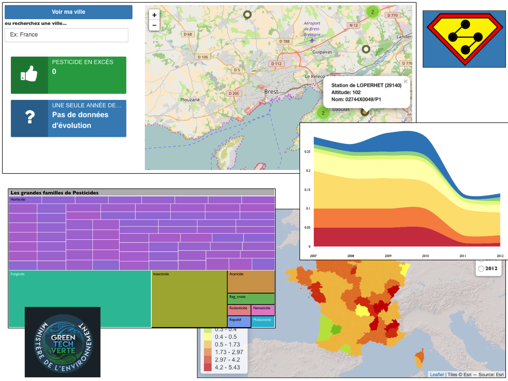

   The [GreenTech Challenge](www.agap-sunshine.inra.fr/holtz-apps/GreenTech_Challenge/)
==============================

  
Overview  
--------
The [GreenTech challenge](http://www.developpement-durable.gouv.fr/Concours-de-data-visualisation-sur.html) is a Dataviz competition proposed by the [French Ministery of environment](http://www.developpement-durable.gouv.fr/). A huge [dataset](http://www.donnees.statistiques.developpement-durable.gouv.fr/dataviz_pesticides/) concerning pesticides in France has been released, and the goal was to propose [innovative visualizations](www.r-graph-gallery.com) to sensibilize and inform citizen concerning the french situation over the past 6 Years.  

We decided to make a team of 4 friends and built a [ShinyApp](https://shiny.rstudio.com/) that allows to efficiently explore this dataset. The app is composed by several sheets, each targeting a specific theme. This tool should allow you to understand what happens in your neighbourhood and in the entire country. It is also studied to improve your genereal knowledge concerning [pesticides](https://en.wikipedia.org/wiki/Pesticide).  

Do not hesitate, try it online [here](www.agap-sunshine.inra.fr/holtz-apps/GreenTech_Challenge/)!  

Here is a screenshot of the main sheets of the app:  



  
  
Input
--------
The dataset used for this study is available online here. Note that the app already charged this dataset, so you do not really need it.  


Local use
--------
The best way to consult the application is [on the web](www.agap-sunshine.inra.fr/holtz-apps/GreenTech_Challenge/). However, you can easily use it locally. There are 2 methods:  
  
Open R and use the code below:
```
install.packages(shiny)
library(shiny)
runGitHub("GreenTech-Challenge","holtzy")
```

This method should work properly. However, it can fail , especially for windows users. In this case, follow these steps:  
-1/ Download this whole repository  
-2/ Open R and install the libraries written at the beginning of the global.r file.  
-3/ Start the app from R:  
```
library(shiny)
runApp("This/is/my/path/GreenTech-Challenge")
```


  
Members
--------
The GreenTech Challenge app has been developped by 4 friends from [Montpellier Supagro](www.supagro.fr/):    
Charles Moszkowicz: [company](http://eneo.fr/fr/contact/)   
Jean-Charles Simonin: [company](http://eneo.fr/fr/contact/)   
Guilhem Marre: [linkedin](https://www.linkedin.com/in/guilhem-marre-42132b28)   
Yan Holtz: [homepage](https://holtzyan.wordpress.com/)    
  


